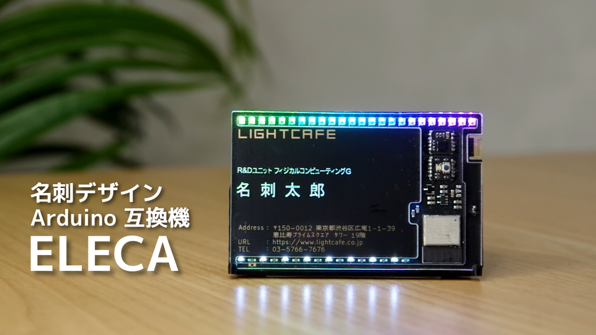

# ELECA
ELECA（エレカ）は**CC BY-SA4.0ライセンス**で**名刺デザイン**の**Arduino互換機**です 
LIGHTCAFE LAB ELECA 作品ページはこちら 
https://lab.lightcafe.co.jp/work/eleca 

## firmware
ELECAに書き込むArduinoのサンプルスケッチです 
給電すると動作がはじまります 

*eleca-ble-write* 
Bluetoothの子機（peripheral）になります 

*eleca-hand-pov* 
ハンディのバーサライタになります 

*eleca-stand* 
レインボーが流れていきます 

## hardware
ELECA付属のハードウェアです 

*3d-print-options* 
3DプリントできるELECA専用スタンドです 

*acryl-cover* 
ELECAの専用アクリルカバーです 
標準的なdxfファイルとsmartDIYsのレーザー加工機で使えるプロジェクトファイルがあります 
## pcb
KiCad (v6.0.10)を使用した回路図と基板図です 

*pcb-eleca* 
ELECAのメイン基板 

*pcb-eleca-extend* 
ELECAの拡張スロット用基板 
・拡張基板1（加速度センサ） 
・拡張基板2（フルカラーLED＋スイッチ） 

# ライセンスについて
この 作品 は <a rel="license" href="https://creativecommons.org/licenses/by-sa/4.0/deed.ja">クリエイティブ・コモンズ 表示 - 継承 4.0 国際 ライセンス</a>の下に提供されています 
 
